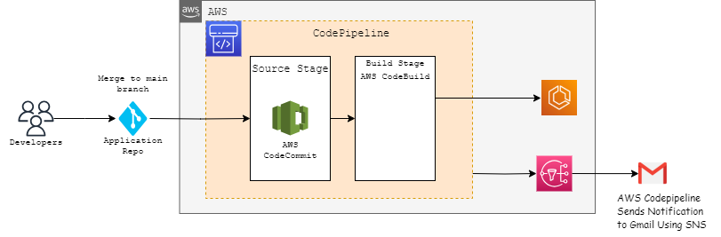

# AWS DevOps Pipeline architecture - CI/CD for Nodejs backend application

## Description

AWS DevOps pipeline architecture -ci/cd for nodejs backend application , with this end user will be able to deploy nodejs backend application . The architecture provides a robust and scalable environment with high availability, security, and monitoring capabilities. It follows best practices to ensure a well-architected AWS infrastructure that can handle your application’s demands while maintaining your data's confidentiality, integrity, and availability.
The goal is to create the pipeline which creates the below-given architecture which includes AWS code pipeline with stages (source stage, build stage ), and SNS notification.
- Who can use AWS DevOps pipeline architecture - CI/CD for Nodejs backend application:
    - Developers responsible for writing Node.js backend code can use the CI/CD pipeline to automate the building, testing, and deployment of their applications. They can focus on coding while relying on the automated pipeline to handle the deployment process.
    - DevOps engineers are instrumental in designing and implementing CI/CD pipelines. They can leverage this blueprint to create an efficient and automated deployment process for Node.js applications, ensuring consistency and speed in releases
    - Infrastructure engineers may collaborate on the Infrastructure as Code (IaC) components of the blueprint, ensuring that the AWS infrastructure supporting the Node.js application is defined, versioned, and managed as code.
    - Release managers can orchestrate the release process using the CI/CD pipeline, ensuring that the correct version of the Node.js application is deployed to production and other environments.
    - QA teams can leverage the CI/CD pipeline to automatically deploy different versions of the Node.js application for testing. Automated testing steps integrated into the pipeline ensure the quality of the deployed code.
    - Can be utilized by companies of various sizes and industries such as Technology, E-commerce, Financial, Healthcare and Life Sciences companies etc that develop and deploy Node.js applications for backend services. Many organizations across various sectors can benefit from implementing a robust CI/CD pipeline for Node.js applications on AWS.

## Introduction
- This Terraform scripts are used to create various AWS resources, including a AWS CodePipeline ,S3 Bucket for Artifacts,AWS SNS for Notifications,IAM Roles and policies
- The main.tf, variable.tf, provider.tf, and backend.tf files are typically used in a Terraform project to organize and configure your infrastructure code

## Installation
Dependencies to create the AWS resource using Terraform: 
- Make sure Terraform is installed.

## Providers

| Name | Version |
|------|---------|
| <a name="provider_aws"></a> [aws](#provider\_aws) | 5.16.2 |

## Modules

No modules.

## Resources

| Name | Type |
|------|------|
| [aws_codebuild_project.codebuild_project](https://registry.terraform.io/providers/hashicorp/aws/latest/docs/resources/codebuild_project) | resource |
| [aws_codecommit_repository.codecommit_repo](https://registry.terraform.io/providers/hashicorp/aws/latest/docs/resources/codecommit_repository) | resource |
| [aws_codepipeline.codepipeline](https://registry.terraform.io/providers/hashicorp/aws/latest/docs/resources/codepipeline) | resource |
| [aws_codestarnotifications_notification_rule.example_notification_rule](https://registry.terraform.io/providers/hashicorp/aws/latest/docs/resources/codestarnotifications_notification_rule) | resource |
| [aws_iam_policy.codepipeline_policy](https://registry.terraform.io/providers/hashicorp/aws/latest/docs/resources/iam_policy) | resource |
| [aws_iam_policy_attachment.codebuild_cloudwatch_attachment](https://registry.terraform.io/providers/hashicorp/aws/latest/docs/resources/iam_policy_attachment) | resource |
| [aws_iam_policy_attachment.codebuild_ecr_attachment](https://registry.terraform.io/providers/hashicorp/aws/latest/docs/resources/iam_policy_attachment) | resource |
| [aws_iam_policy_attachment.codebuild_policy_attachment](https://registry.terraform.io/providers/hashicorp/aws/latest/docs/resources/iam_policy_attachment) | resource |
| [aws_iam_policy_attachment.codebuild_s3_attachment](https://registry.terraform.io/providers/hashicorp/aws/latest/docs/resources/iam_policy_attachment) | resource |
| [aws_iam_policy_attachment.codepipeline_policy_attachment](https://registry.terraform.io/providers/hashicorp/aws/latest/docs/resources/iam_policy_attachment) | resource |
| [aws_iam_role.codebuild_service_role](https://registry.terraform.io/providers/hashicorp/aws/latest/docs/resources/iam_role) | resource |
| [aws_iam_role.pipeline_service_role](https://registry.terraform.io/providers/hashicorp/aws/latest/docs/resources/iam_role) | resource |
| [aws_s3_bucket.artifact_bucket](https://registry.terraform.io/providers/hashicorp/aws/latest/docs/resources/s3_bucket) | resource |
| [aws_sns_topic.sns_topic](https://registry.terraform.io/providers/hashicorp/aws/latest/docs/resources/sns_topic) | resource |
| [aws_sns_topic_policy.sns_topic_policy](https://registry.terraform.io/providers/hashicorp/aws/latest/docs/resources/sns_topic_policy) | resource |
| [aws_sns_topic_subscription.sns_subscription](https://registry.terraform.io/providers/hashicorp/aws/latest/docs/resources/sns_topic_subscription) | resource |
| [aws_caller_identity.current](https://registry.terraform.io/providers/hashicorp/aws/latest/docs/data-sources/caller_identity) | data source |

## Inputs

| Name | Description | Type | Default | Required |
|------|-------------|------|---------|:--------:|
| <a name="input_aws_region"></a> [aws\_region](#input\_aws\_region) | n/a | `string` | `""` | |
| <a name="input_branch_name"></a> [branch\_name](#input\_branch\_name) | Name of the branch in the CodeCommit repository that will be monitored for changes.Whenever changes are pushed to this branch, the pipeline will automatically start. | `string` | `""` |  |
| <a name="input_compute_type"></a> [compute\_type](#input\_compute\_type) | Type of the build environment that CodeBuild will use to build your application. | `string` | `""` |  |
| <a name="input_emails"></a> [emails](#input\_emails) | Email address to receive notifications via Amazon SNS (Simple Notification Service). You will receive status updates and notifications about pipeline events on this email address. | `list(string)` | `[]` | |
| <a name="input_environment"></a> [environment](#input\_environment) | The name of env in which we need to provision the resources in AWS console. | `string` | `""` |  |
| <a name="input_image"></a> [image](#input\_image) | The Docker image for the build environment in CodeBuild. This image will be used to run the build process for your application. | `string` | `""` |  |
| <a name="input_repository_name"></a> [repository\_name](#input\_repository\_name) | Name of the AWS CodeCommit repository where your application source code is stored. | `string` | `""` |  |
| <a name="input_stack_name"></a> [stack\_name](#input\_stack\_name) | This name will be added as a prefix to all the resource names | `string` | `""` |  |
| <a name="input_type"></a> [type](#input\_type) | Type of the build environment that CodeBuild will use to build your application. | `string` | `""` |  |

## Outputs

| Name | Description |
|------|-------------|
| <a name="output_pipeline_service_role_arn"></a> [pipeline\_service\_role\_arn](#output\_pipeline\_service\_role\_arn) | ARN of the CodePipeline Service Role |

### Usage
Once the Variable and the Module is ready follow the below commands to create the resource
- ```terraform init``` to download the modules
- ```terraform plan``` to generate an execution plan for your infrastructure. 
- ```terraform apply``` to apply the changes and create the infrastructure.
- ```terraform destroy``` to delete the resource which is created through terraform.
<!-- END_TF_DOCS -->
