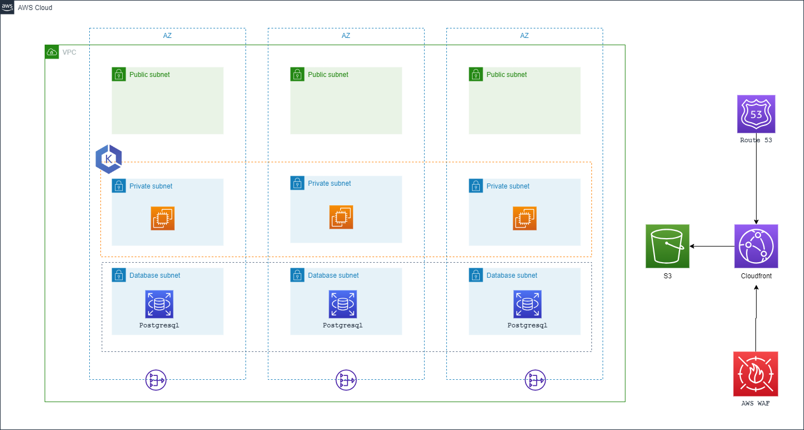

<!-- BEGIN_TF_DOCS -->
# Microservices architecture with EKS, S3 CDN, and PostgreSQL

## Discription

Microservices architecture with EKS, S3 CDN, and PostgreSQL implemented through IaC is a collaborative framework that involves various roles throughout the software development and deployment lifecycle. Its modular and scalable nature makes it suitable for diverse stakeholders, promoting efficiency, maintainability, and scalability in cloud-based applications.
Who can use Micro service architecture with EKS, S3 CDN and PSQL:
1) Developers can leverage the microservices architecture to build and deploy individual services independently. They can work on specific microservices, taking advantage of EKS for container orchestration and scalability.
2) DevOps engineers can utilize Terraform to define and manage the infrastructure as code (IaC), automating the deployment and scaling of microservices on EKS. They can also configure CI/CD pipelines for continuous integration and delivery
3) System architects can design the overall microservices architecture, defining the communication patterns between services. They can use Terraform to model the infrastructure components, ensuring scalability, reliability, and fault tolerance.
4) DBAs can be involved in setting up and managing the PostgreSQL database instances, ensuring proper configuration, backups, and monitoring.
5) End users interact with the application that is built on the microservices architecture. The use of CDN ensures faster content delivery and a better user experience.

## Providers

| Name | Version |
|------|---------|
|  [aws](#provider\_aws) | 5.14.0 |

## Modules

| Name | Source | Version |
|------|--------|---------|
|  [cloudfront](#module\_cloudfront) | terraform-aws-modules/cloudfront/aws | 3.2.0 |
|  [eks](#module\_eks) | terraform-aws-modules/eks/aws | 19.16.0 |
|  [network](#module\_network) | terraform-aws-modules/vpc/aws | 5.1.1 |
|  [postgres](#module\_postgres) | terraform-aws-modules/rds-aurora/aws | 8.3.1 |
|  [rds\_security\_group](#module\_rds\_security\_group) | terraform-aws-modules/security-group/aws | 5.1.0 |
|  [s3\_bucket](#module\_s3\_bucket) | terraform-aws-modules/s3-bucket/aws | 3.6.0 |

## Resources

| Name | Type |
|------|------|
| [aws_route53_record.record](https://registry.terraform.io/providers/hashicorp/aws/latest/docs/resources/route53_record) | resource |
| [aws_s3_bucket_policy.cataloguing_mfe](https://registry.terraform.io/providers/hashicorp/aws/latest/docs/resources/s3_bucket_policy) | resource |
| [aws_availability_zones.available](https://registry.terraform.io/providers/hashicorp/aws/latest/docs/data-sources/availability_zones) | data source |
| [aws_iam_policy.ssm_managed_instance_core](https://registry.terraform.io/providers/hashicorp/aws/latest/docs/data-sources/iam_policy) | data source |

## Inputs

| Name | Description | Type | Default | Required |
|------|-------------|------|---------|:--------:|
|  [acm\_certificate\_arn](#input\_acm\_certificate\_arn) | ARN of the certificate | `string` |  | no |
|  [cdn\_aliases](#input\_cdn\_aliases) | The aliases name | `list(string)` |  | no |
|  [cluster\_version](#input\_cluster\_version) | Enter the version of your EKS cluster | `string` |  | no |
|  [database\_private\_subnets](#input\_database\_private\_subnets) | A list of database subnets CIDR inside the VPC | `list(string)` || no |
|  [db\_instance\_class](#input\_db\_instance\_class) | the type of the instance DB class | `any` | | no |
|  [db\_master\_password](#input\_db\_master\_password) | password for db | `string` |  | no |
|  [db\_master\_username](#input\_db\_master\_username) | username for db | `string` |  | no |
|  [eks\_node\_group\_capacity\_type](#input\_eks\_node\_group\_capacity\_type) | Capacity of the node group instance to be | `string` |  | no |
|  [eks\_node\_group\_desired\_size](#input\_eks\_node\_group\_desired\_size) | Desired size of the eks node | `number` | | no |
|  [eks\_node\_group\_instance\_types](#input\_eks\_node\_group\_instance\_types) | Type of the node group instance to be | `list(string)` |  | no |
|  [eks\_node\_group\_max\_size](#input\_eks\_node\_group\_max\_size) | maximum size of the eks node | `number` |  | no |
|  [eks\_node\_group\_min\_size](#input\_eks\_node\_group\_min\_size) | minimum size of the eks node | `number` |  | no |
|  [engine\_type](#input\_engine\_type) | The engine type for DB | `string` |  | no |
|  [engine\_version](#input\_engine\_version) | The engine version for DB | `any` || no |
|  [environment](#input\_environment) | the name of the environment | `string` |  | no |
|  [hosted\_zone\_id](#input\_hosted\_zone\_id) | The id of the route53 zone | `string` | | no |
|  [private\_subnets](#input\_private\_subnets) | A list of private subnets CIDR inside the VPC | `list(string)` |  | no |
|  [public\_subnets](#input\_public\_subnets) | A list of public subnets CIDR inside the VPC | `list(string)` |  | no |
|  [rds\_storage](#input\_rds\_storage) | The storage of the DB instance | `number` | | no |
|  [record\_name](#input\_record\_name) | the name of the record | `string` |  | no |
|  [region](#input\_region) | the region in which to deploy resources | `string` |  | no |
|  [stack\_name](#input\_stack\_name) | the name of the stack | `string` |  | no |
|  [vpc\_cidr\_range](#input\_vpc\_cidr\_range) | The CIDR range for your VPC |  |  | no |

## Outputs

No outputs.
<!-- END_TF_DOCS -->
