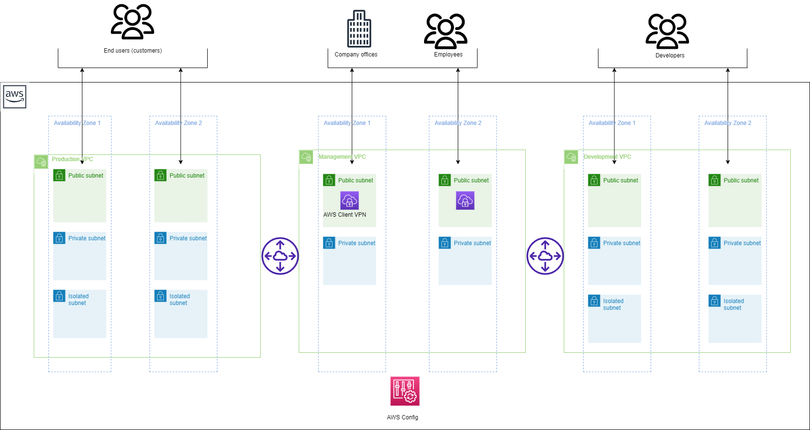

# AWS Fintech architecture using terraform template

## Description


The architecture provides a robust and scalable environment with high availability, security, and monitoring capabilities. It follows best practices to ensure a well-architected AWS infrastructure that can handle your application’s demands while maintaining your data's confidentiality, integrity, and availability. It's for companies that want to manage their business-to-business (B2B) or business-to-consumer (B2C) fintech software in the cloud.
FinTech Blueprint on AWS using Infrastructure as Code is a collaborative tool that involves various roles throughout the software development and deployment lifecycle in the financial technology sector. It facilitates consistency, scalability, and security in the deployment of FinTech applications and services on the AWS cloud.
- Who can use Fintech Blueprint on AWS
    - Developers working in the FinTech domain can leverage the blueprint to deploy and scale applications that handle financial transactions, data analytics, risk management, or other financial services on AWS.
    - DevOps engineers play a crucial role in automating infrastructure deployment and management. They can use the IaC blueprint to define and provision AWS resources, set up CI/CD pipelines, and manage configurations for FinTech applications.
    - System architects design the overall architecture of FinTech applications, ensuring scalability, security, and compliance. They can use IaC to model the infrastructure components, allowing for consistent and repeatable deployments.
    - Professionals working with financial data analytics can benefit from the blueprint's ability to provision scalable and performant AWS resources for processing and analyzing financial data.
    - Professionals responsible for regulatory compliance in the financial sector can benefit from the IaC blueprint by ensuring that the infrastructure configurations align with industry regulations and standards.

## Introduction
- This Terraform scripts are used to create various AWS resources, including a Virtual Private Cloud (VPC), VPC peering , NAT gateway , AWS client VPN and AWS config rules.
- The main.tf, variable.tf, provider.tf, and backend.tf files are typically used in a Terraform project to organize and configure your infrastructure code

## Installation
Dependencies to create the AWS resource using Terraform: 
- Make sure Terraform is installed.

## Providers

| Name | Version |
|------|---------|
| <a name="provider_aws"></a> [aws](#provider\_aws) | 5.18.1 |

## Modules

| Name | Source | Version |
|------|--------|---------|
| <a name="module_network"></a> [network](#module\_network) | terraform-aws-modules/vpc/aws | 5.1.1 |
| <a name="module_network1"></a> [network1](#module\_network1) | terraform-aws-modules/vpc/aws | 5.1.1 |
| <a name="module_network2"></a> [network2](#module\_network2) | terraform-aws-modules/vpc/aws | 5.1.1 |

## Resources

| Name | Type |
|------|------|
| [aws_ec2_client_vpn_endpoint.management_vpn](https://registry.terraform.io/providers/hashicorp/aws/latest/docs/resources/ec2_client_vpn_endpoint) | resource |
| [aws_route.development_to_production](https://registry.terraform.io/providers/hashicorp/aws/latest/docs/resources/route) | resource |
| [aws_route.management_to_development](https://registry.terraform.io/providers/hashicorp/aws/latest/docs/resources/route) | resource |
| [aws_route.production_to_management](https://registry.terraform.io/providers/hashicorp/aws/latest/docs/resources/route) | resource |
| [aws_vpc_peering_connection.development_to_production](https://registry.terraform.io/providers/hashicorp/aws/latest/docs/resources/vpc_peering_connection) | resource |
| [aws_vpc_peering_connection.management_to_development](https://registry.terraform.io/providers/hashicorp/aws/latest/docs/resources/vpc_peering_connection) | resource |
| [aws_vpc_peering_connection.production_to_management](https://registry.terraform.io/providers/hashicorp/aws/latest/docs/resources/vpc_peering_connection) | resource |
| [aws_availability_zones.available](https://registry.terraform.io/providers/hashicorp/aws/latest/docs/data-sources/availability_zones) | data source |

## Inputs

| Name | Description | Type | Default | Required |
|------|-------------|------|---------|:--------:|
| <a name="input_aws_configrules"></a> [aws\_configrules](#input\_aws\_configrules) | The aws_configrules variable allows you to specify a list of AWS Config rules or configurations within your infrastructure code. | `string` |  | no |
| <a name="input_clientcidrblock"></a> [clientcidrblock](#input\_clientcidrblock) | SSL/TLS mutual authentication, clients can provide certificates to servers to prove their identity. | `string` | | no |
| <a name="input_clientrootcertificate"></a> [clientrootcertificate](#input\_clientrootcertificate) | SSL/TLS server certificate that is used to secure communications between clients (e.g., web browsers) and a web server. | `string` |  | no |
| <a name="input_development_isolated_cidr"></a> [development\_isolated\_cidr](#input\_development\_isolated\_cidr) | Tailor the CIDR ranges for  subnets using a list format. To define multiple subnets, provide a comma-separated list of CIDR ranges enclosed in square brackets. For example:["172.16.1.0/24", "172.16.3.0/24"]. | `list(string)` | | no |
| <a name="input_development_private_cidr"></a> [development\_private\_cidr](#input\_development\_private\_cidr) | Tailor the CIDR ranges for  subnets using a list format. To define multiple subnets, provide a comma-separated list of CIDR ranges enclosed in square brackets. For example:["172.16.1.0/24", "172.16.3.0/24"]. | `list(string)` | | no |
| <a name="input_development_public_cidr"></a> [development\_public\_cidr](#input\_development\_public\_cidr) | Tailor the CIDR ranges for  subnets using a list format. To define multiple subnets, provide a comma-separated list of CIDR ranges enclosed in square brackets. For example:["172.16.1.0/24", "172.16.3.0/24"]. | `list(string)` |  | no |
| <a name="input_management_private_cidr"></a> [management\_private\_cidr](#input\_management\_private\_cidr) |Tailor the CIDR ranges for  subnets using a list format. To define multiple subnets, provide a comma-separated list of CIDR ranges enclosed in square brackets. For example: ["192.168.1.0/24", "192.168.3.0/24"]. | `list(string)` || no |
| <a name="input_management_public_cidr"></a> [management\_public\_cidr](#input\_management\_public\_cidr) | Tailor the CIDR ranges for  subnets using a list format. To define multiple subnets, provide a comma-separated list of CIDR ranges enclosed in square brackets. For example: ["192.168.1.0/24", "192.168.3.0/24"]. | `list(string)` | | no |
| <a name="input_production_isolated_cidr"></a> [production\_isolated\_cidr](#input\_production\_isolated\_cidr) | Customize the CIDR ranges for your isolated subnets using a list format. To define multiple private subnets, provide a comma-separated list of CIDR ranges enclosed in square brackets. For instance: ["10.0.0.0/24", "10.0.1.0/24", "10.0.2.0/24"]. | `list(string)` | | no |
| <a name="input_production_private_cidr"></a> [production\_private\_cidr](#input\_production\_private\_cidr) |Customize the CIDR ranges for your private subnets using a list format. To define multiple private subnets, provide a comma-separated list of CIDR ranges enclosed in square brackets. For instance: ["10.0.0.0/24", "10.0.1.0/24", "10.0.2.0/24"]. | `list(string)` |  | no |
| <a name="input_production_public_cidr"></a> [production\_public\_cidr](#input\_production\_public\_cidr) | Customize the CIDR ranges for your public subnets using a list format. To define multiple private subnets, provide a comma-separated list of CIDR ranges enclosed in square brackets. For instance: ["10.0.0.0/24", "10.0.1.0/24", "10.0.2.0/24"]. | `list(string)` | | no |
| <a name="input_server_certification"></a> [server\_certification](#input\_server\_certification) | SSL/TLS server certificate that is used to secure communications between clients (e.g., web browsers) and a web server. | `string` |  | no |
| <a name="input_vpc_development_cidr"></a> [vpc\_development\_cidr](#input\_vpc\_development\_cidr) |Specify the range of IP addresses for your VPC in CIDR notation. For example, if you want to allocate IP addresses from 172.16.0.0 to 172.16.255.255, you would use "172.16.0.0/16" as the CIDR range. | `string` |  | no |
| <a name="input_vpc_management_cidr"></a> [vpc\_management\_cidr](#input\_vpc\_management\_cidr) | Specify the range of IP addresses for your VPC in CIDR notation. For example, if you want to allocate IP addresses from 192.168.0.0 to 192.168.255.255, you would use "192.168.0.0/16" as the CIDR range. | `string` | | no |
| <a name="input_vpc_production_cidr"></a> [vpc\_production\_cidr](#input\_vpc\_production\_cidr) | Specify the range of IP addresses for your VPC in CIDR notation. For example, if you want to allocate IP addresses from 10.0.0.0 to 10.0.255.255, you would use "10.0.0.0/16" as the CIDR range. | `string` || no |

## Outputs

### Usage
Once the Variable and the Module is ready follow the below commands to create the resource
- ```terraform init``` to download the modules
- ```terraform plan``` to generate an execution plan for your infrastructure. 
- ```terraform apply``` to apply the changes and create the infrastructure.
- ```terraform destroy``` to delete the resource which is created through terraform.
